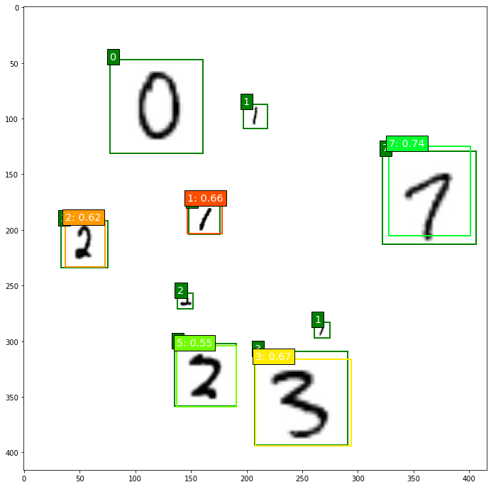

# Object Detection on MNIST
 >  Detect randomly placed digits against white background using SSD
 
 
 
 Table of Contents
=================

* [Installation](#installation)
* [Usage](#usage)
* [Author](#author)


## Installation

```sh
pip install -r requirements.txt
```
## Usage

```sh
python train.py #To train model

```
Then navigate to localhost:8888 to run inference.ipynb


## Author

**Arshdeep Singh**

***
